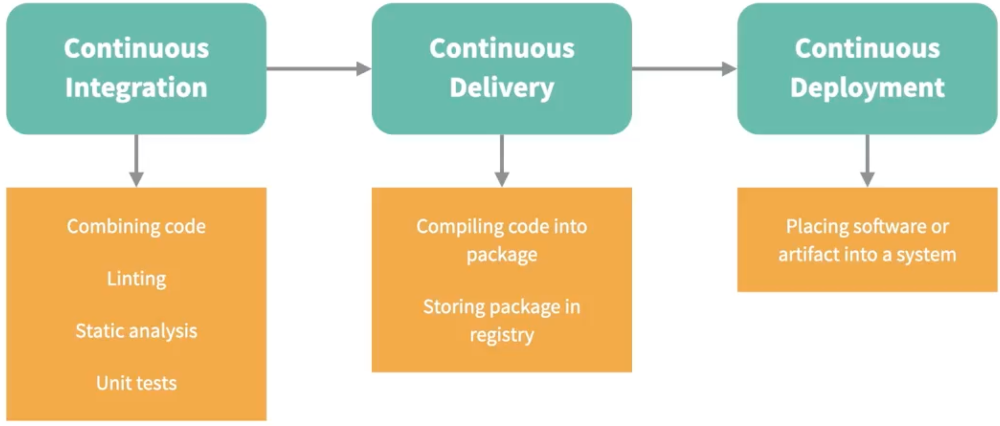

<!-- CI/CD/CD -->

    <h1>CI/CD/CD</h1>

---

# CI/CD/CD

* Continuous Integration

Pushing code to a Version Control System (VCS such as git etc.).

* Continuous Delivery

Packaging your code (We will create Docker images).

* Continuous Deployment

Deploy to a server.

We will look differently at continuous delivery vs. deployment in this course, but we will call it CI/CD. 

---

# Overview of CI/CD/CD

Goal: automation. 
Term: Pipelines

---

# Continuous Integration (CI)

  - Developers frequently merge code changes into a central repository

  - Automatically builds and tests merged code

  - Detects integration issues early on

  - Goal: Resolve problems early and quickly

---

# Continuous Delivery (CD)

  - Ensures merged and tested code is always in a releasable state

  - Automated build process

  - Goal: To have code ready for release

---

# Continuous Deployment (CD)

  - Approach that emphasizes continuously delivering new features and improvements

  - Integrates feedback from users and stakeholders

  - Iterates on the product

  - Continuously deploys updates

  - Provides value at a faster pace

---

# Continuous Delivery vs. Continuous Deployment

There are many different interpretations of the two terms.

Historically, the continuous delivery was the first term to exist. Contiuous deployment is a more recent term.

For some the two terms are interchangeable. 

For others, continuous delivery has superseded the term continuous deployment.

One interpretation is that continuous delivery requires a manual step to deploy to production, while continuous deployment is fully automated (hands-off deployments).

---

# This course's interpretation of Continuous Delivery vs. Continuous Deployment

**Continuous Delivery**: Deliver build artifacts. In our case we will build Docker images and publish them to a container registry.

**Continuous Deployment**: Deploy to production. In our case we will deploy the Docker images to a server and run them.

You don't have to agree with this interpretation, but we use it to make a clear distinction between delivering artifacts and deploying to production.

Beware that you might end up in a job that uses the terms differently.

---

# In the DevOps 8, which part relate to CI, CD, CD and CF?

CF = Continuous Feedback. 

*Discuss in pairs*

    

---

# DevOps 8, CI, CD, CD, CF

    

Source: https://kapernikov.com/wp-content/uploads/2021/06/devops-8.png

---

# A 5 minute video on CI/CD

---

# CI/CD solutions

There are many CI/CD solutions. In our following example we will have a closer look to GitHub Actions.

However, you might consider an alternative technology.

The following lists should link you to some commonly used products.

---

# CI/CD solutions - Self-hosted

[Jenkins](https://jenkins.io/index.html)  

[Bamboo](https://www.atlassian.com/software/bamboo)  

[TeamCity](https://www.jetbrains.com/teamcity/)  

[Concourse](https://concourse.ci)  

[Azure DevOps Server](https://azure.microsoft.com/en-us/services/devops/server/)  

[Drone](https://www.drone.io/)

---

# CI/CD solutions - CI/CD as a service

[Travis CI](https://travis-ci.org/)  

[CircleCI](https://circleci.com)  

[GitHub Actions](https://github.com/features/actions)  

[GitLab CI](https://docs.gitlab.com/ee/topics/build_your_application.html)  

[GoCD](https://www.gocd.org/)  

[AWS CodePipeline](https://aws.amazon.com/codepipeline/)

[Azure DevOps Services](https://azure.microsoft.com/en-us/services/devops/)

